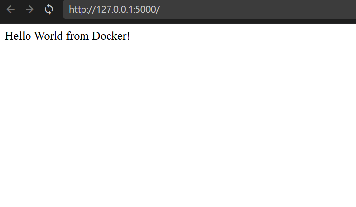
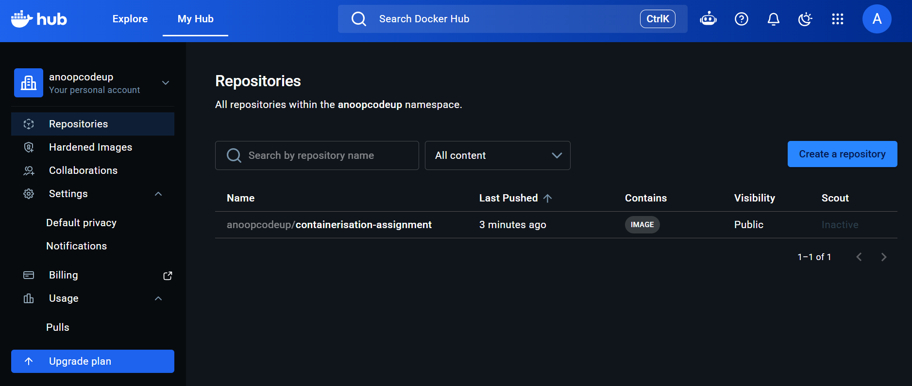
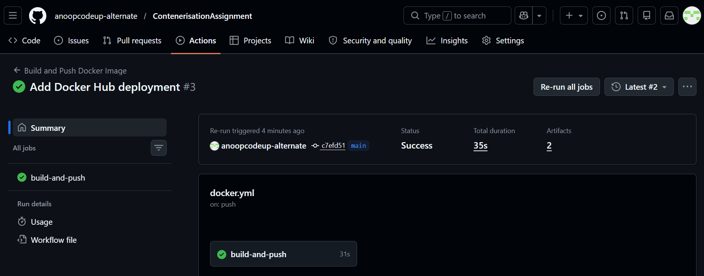

# Automated Container Build Pipeline

## Overview

This project demonstrates containerization and CI/CD automation using Docker, Docker Hub, GitHub, and GitHub Actions.

A simple Flask-based "Hello World" web application is containerized using Docker. GitHub Actions automatically builds and publishes the Docker image to Docker Hub whenever code is pushed to the main branch.

---

## Project Objectives

* Develop a simple Python Flask web application.
* Containerize the application using Docker.
* Automate Docker image building using GitHub Actions.
* Push Docker images to Docker Hub automatically.
* Demonstrate Continuous Integration and Continuous Deployment (CI/CD).

---

## Technologies Used

* Python 3
* Flask
* Docker
* Docker Hub
* GitHub
* GitHub Actions
* WSL2

---

## Project Structure

```text
containerAssignment/
│
├── app.py
├── requirements.txt
├── Dockerfile
├── README.md
│
├── images/
│   ├── local_app_running.png
│   ├── docker_hub_repo.png
│   └── github_actions_success.png
│
└── .github/
    └── workflows/
        └── docker.yml
```

---

## Application Functionality

The Flask application exposes a single endpoint:

```http
GET /
```

Response:

```text
Hello World from Docker!
```

---

## Running the Application Locally

### Install Dependencies

```bash
pip install -r requirements.txt
```

### Run the Application

```bash
python app.py
```

Open:

```text
http://localhost:5000
```

---

## Docker Containerization

### Build Docker Image

```bash
docker build -t hello-app .
```

### Run Docker Container

```bash
docker run -p 5000:5000 hello-app
```

Access the application:

```text
http://localhost:5000
```

---

## GitHub Actions Workflow

This project uses GitHub Actions to automate the Docker image build and deployment process.

### Workflow Trigger

The workflow runs automatically whenever code is pushed to the `main` branch.

```yaml
on:
  push:
    branches:
      - main
```

### Workflow Steps

1. Checkout repository source code.
2. Configure Docker Buildx.
3. Authenticate with Docker Hub using GitHub Secrets.
4. Build Docker image.
5. Push Docker image to Docker Hub.
6. Report build status.

---

## CI/CD Pipeline

```text
Developer Pushes Code
          │
          ▼
   GitHub Repository
          │
          ▼
   GitHub Actions
          │
          ▼
   Docker Image Build
          │
          ▼
   Docker Hub Registry
```

---

## Docker Hub Integration

The workflow automatically publishes Docker images to Docker Hub using the following repository secrets:

| Secret Name     | Purpose                 |
| --------------- | ----------------------- |
| DOCKER_USERNAME | Docker Hub Username     |
| DOCKER_TOKEN    | Docker Hub Access Token |

After a successful workflow run, the latest image is available from Docker Hub.

Example:

```bash
docker pull <dockerhub-username>/<repository-name>:latest
```

---

## Screenshots

### 1. Local Application Running

The Flask application running successfully in the browser.



---

### 2. Docker Hub Repository

Docker image successfully pushed and stored in Docker Hub.



---

### 3. GitHub Actions Workflow Success

GitHub Actions workflow successfully building and publishing the Docker image.



---

## Learning Outcomes

Through this project, the following concepts were implemented:

* Docker Containerization
* Dockerfile Creation
* Container Image Management
* Git Version Control
* GitHub Repository Management
* GitHub Actions Automation
* Docker Hub Integration
* Continuous Integration (CI)
* Continuous Deployment (CD)
* WSL2-based Development Environment

---

## Assignment Deliverables

* Flask Web Application
* Dockerfile
* Docker Container Image
* GitHub Repository
* GitHub Actions Workflow
* Docker Hub Repository
* Project Documentation (README)
* Supporting Screenshots

---

## Author

**Anoop Kumar**

Automated Container Build Pipeline Assignment
